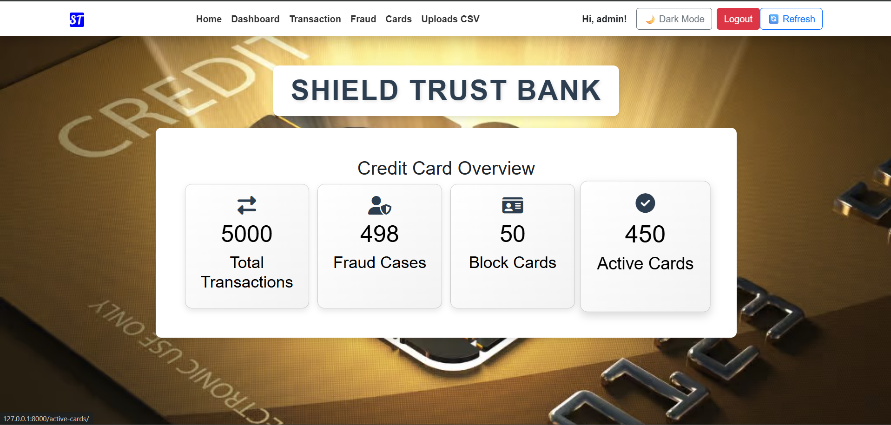
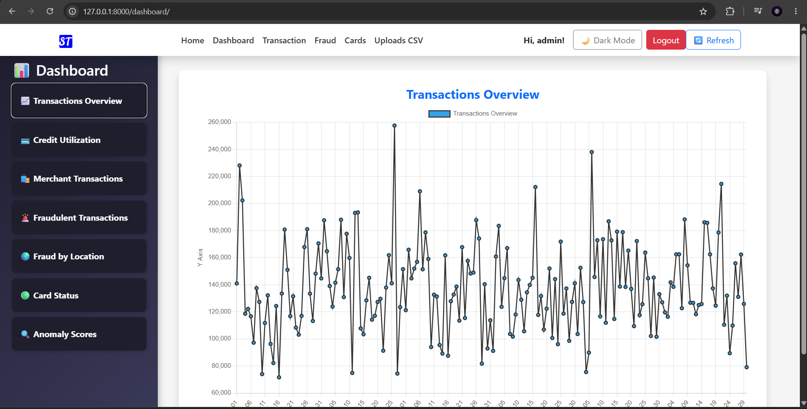
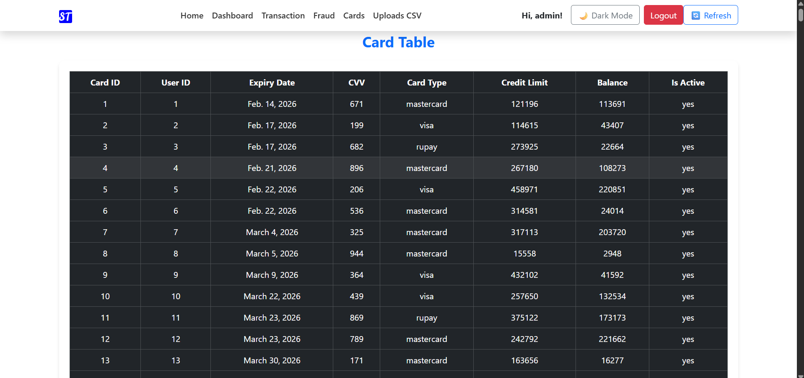
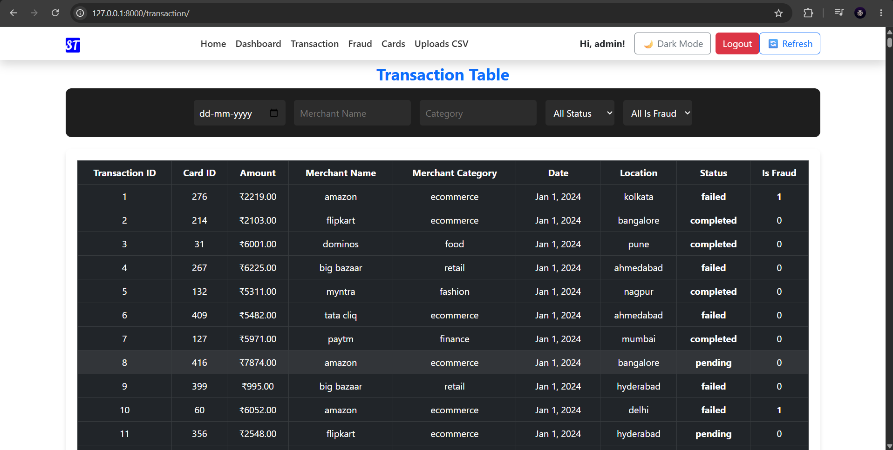
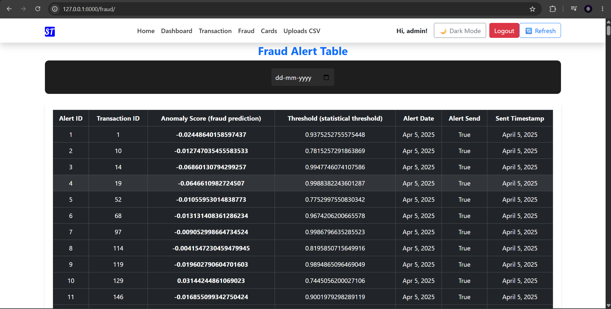
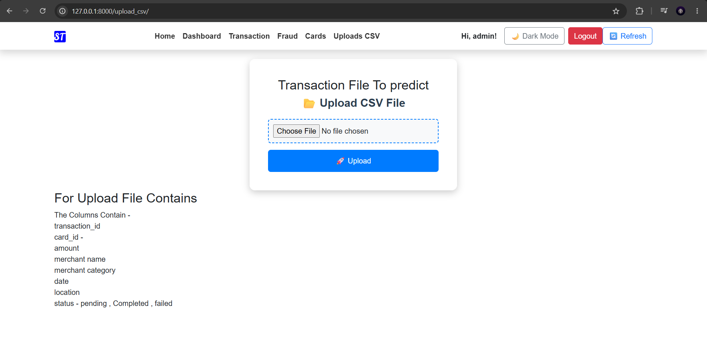

# Credit Card Fraud Detection

A Django-based credit card monitoring project with:

- user authentication
- transaction and card dashboards
- fraud flagging backed by trained ML models
- CSV transaction upload
- scheduled fraud prediction checks
- scheduled fraud alert emails
- chart-based reporting for transactions, cards, and fraud trends

## Project Structure

- `creditcard/` - Django project settings, URL routing, and WSGI/ASGI entry points
- `fraud/` - main app with models, views, ML inference, schedulers, and management commands
- `templates/` - HTML templates for login, dashboard, transactions, cards, upload, and fraud views
- `static/` - CSS, JavaScript, and image assets
- `db.sqlite3` - local SQLite database file currently present in the repo

## Main Features

- Login and logout flow
- Home dashboard with summary metrics
- Transaction listing
- Fraud alert listing
- Card listing and active card filtering
- CSV upload for transaction imports
- JSON endpoints for chart visualizations
- Automated fraud scoring using saved ML artifacts
- Email alerts for detected fraud cases

## Tech Stack

- Python 3.x
- Django 5.1.6
- pandas
- joblib
- APScheduler
- MySQL configured in `creditcard/settings.py`

## Setup

1. Create and activate a virtual environment.
2. Install dependencies:

```bash
pip install -r requirements.txt
```

3. Install any additional packages used by the project but not listed in `requirements.txt`, if needed:

```bash
pip install django-extensions mysqlclient
```

4. Configure your database in `creditcard/settings.py`.

The project currently points to a local MySQL database named `creditcard` with username `root` and password `12345`.

5. Run migrations:

```bash
python manage.py migrate
```

6. Create a Django superuser:

```bash
python manage.py createsuperuser
```

7. Start the development server:

```bash
python manage.py runserver
```

## Scheduled Jobs

The project includes two management commands for background processing:

```bash
python manage.py predict_run
python manage.py email_run
```

- `predict_run` starts the fraud prediction scheduler and checks for new transactions every 90 seconds.
- `email_run` starts the email scheduler and sends fraud alert emails every 2 minutes.

## Key URLs

- `/` - sign in
- `/home/` - dashboard home
- `/transaction/` - transaction list
- `/fraud/` - fraud alerts
- `/dashboard/` - chart dashboard
- `/cards/` - all cards
- `/active-cards/` - active cards only
- `/upload_csv/` - CSV upload page
- `/signout/` - sign out

## ML Artifacts

The fraud inference pipeline uses the saved model files stored in `fraud/`:

- `label_encoders.sav`
- `scaler.sav`
- `isolation_forest.sav`
- `logistic_model.sav`

These files are loaded by `fraud/ml_model.py` during fraud prediction.

## Notes

- The project is configured with `DEBUG = True`, so it should only be used in development unless hardened for production.
- Database credentials and email credentials are currently hard-coded in settings, so they should be moved to environment variables before production use.
- The repository includes `db.sqlite3`, but the active Django configuration is set to MySQL.

## Images
Home


Dashboard


Card table


Transaction 


FraudAlert


upload data with csv 

